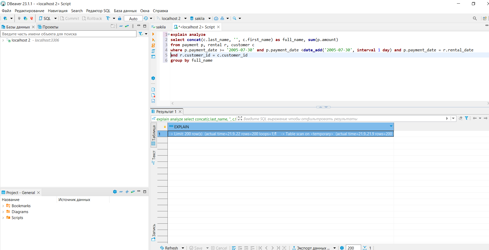

# `Домашнее задание к занятию «Индексы» - Зозуля Максим`

### Задание 1

Напишите запрос к учебной базе данных, который вернёт процентное отношение общего размера всех индексов к общему размеру всех таблиц.


### Задание 2

Выполните explain analyze следующего запроса:
```sql
select distinct concat(c.last_name, ' ', c.first_name), sum(p.amount) over (partition by c.customer_id, f.title)
from payment p, rental r, customer c, inventory i, film f
where date(p.payment_date) = '2005-07-30' and p.payment_date = r.rental_date and r.customer_id = c.customer_id and i.inventory_id = r.inventory_id

-> Limit: 200 row(s)  (cost=0..0 rows=0) (actual time=8695..8695 rows=200 loops=1)
    -> Table scan on <temporary>  (cost=2.5..2.5 rows=0) (actual time=8695..8695 rows=200 loops=1)
        -> Temporary table with deduplication  (cost=0..0 rows=0) (actual time=8695..8695 rows=391 loops=1)
            -> Window aggregate with buffering: sum(payment.amount) OVER (PARTITION BY c.customer_id,f.title )   (actual time=3479..8390 rows=642000 loops=1)
                -> Sort: c.customer_id, f.title  (actual time=3479..3597 rows=642000 loops=1)
                    -> Stream results  (cost=22.2e+6 rows=16e+6) (actual time=16.7..2685 rows=642000 loops=1)
                        -> Nested loop inner join  (cost=22.2e+6 rows=16e+6) (actual time=16..2275 rows=642000 loops=1)
                            -> Nested loop inner join  (cost=20.6e+6 rows=16e+6) (actual time=13.5..2043 rows=642000 loops=1)
                                -> Nested loop inner join  (cost=19e+6 rows=16e+6) (actual time=10.5..1775 rows=642000 loops=1)
                                    -> Inner hash join (no condition)  (cost=1.58e+6 rows=15.8e+6) (actual time=7.86..120 rows=634000 loops=1)
                                        -> Filter: (cast(p.payment_date as date) = '2005-07-30')  (cost=1.87 rows=15813) (actual time=3.03..54.3 rows=634 loops=1)
                                            -> Table scan on p  (cost=1.87 rows=15813) (actual time=3..51 rows=16044 loops=1)
                                        -> Hash
                                            -> Covering index scan on f using idx_title  (cost=112 rows=1000) (actual time=3.66..4.65 rows=1000 loops=1)
                                    -> Covering index lookup on r using rental_date (rental_date=p.payment_date)  (cost=1 rows=1.01) (actual time=0.00162..0.00243 rows=1.01 loops=634000)
                                -> Single-row index lookup on c using PRIMARY (customer_id=r.customer_id)  (cost=0.001 rows=1) (actual time=223e-6..250e-6 rows=1 loops=642000)
                            -> Single-row covering index lookup on i using PRIMARY (inventory_id=r.inventory_id)  (cost=0.001 rows=1) (actual time=180e-6..208e-6 rows=1 loops=642000)


```

- перечислите узкие места;
```
 Судя по анализу, много производительности съедает "оконная функция" тем более с таким кол-вом строк. 
 то же можно сказать и о "временной таблице с удалением дубликатов" и "Сканирование таблицы p"
 ```
- оптимизируйте запрос: внесите корректировки по использованию операторов, при необходимости добавьте индексы.



```
-> Limit: 200 row(s)  (actual time=21.9..22 rows=200 loops=1)
    -> Table scan on <temporary>  (actual time=21.9..21.9 rows=200 loops=1)
        -> Aggregate using temporary table  (actual time=21.9..21.9 rows=391 loops=1)
            -> Nested loop inner join  (cost=4108 rows=1779) (actual time=0.151..19.7 rows=642 loops=1)
                -> Nested loop inner join  (cost=3485 rows=1779) (actual time=0.136..18.1 rows=642 loops=1)
                    -> Filter: ((p.payment_date >= TIMESTAMP'2005-07-30 00:00:00') and (p.payment_date < <cache>(('2005-07-30' + interval 1 day))))  (cost=1606 rows=1757) (actual time=0.108..14.3 rows=634 loops=1)
                        -> Table scan on p  (cost=1606 rows=15813) (actual time=0.0819..10.4 rows=16044 loops=1)
                    -> Covering index lookup on r using rental_date (rental_date=p.payment_date)  (cost=0.969 rows=1.01) (actual time=0.00397..0.00565 rows=1.01 loops=634)
                -> Single-row index lookup on c using PRIMARY (customer_id=r.customer_id)  (cost=0.25 rows=1) (actual time=0.00208..0.00213 rows=1 loops=642)


```
## Дополнительные задания (со звёздочкой*)
Эти задания дополнительные, то есть не обязательные к выполнению, и никак не повлияют на получение вами зачёта по этому домашнему заданию. Вы можете их выполнить, если хотите глубже шире разобраться в материале.

### Задание 3*

Самостоятельно изучите, какие типы индексов используются в PostgreSQL. Перечислите те индексы, которые используются в PostgreSQL, а в MySQL — нет.
```
Partial index, Function based index, Bitmap index.	
```
